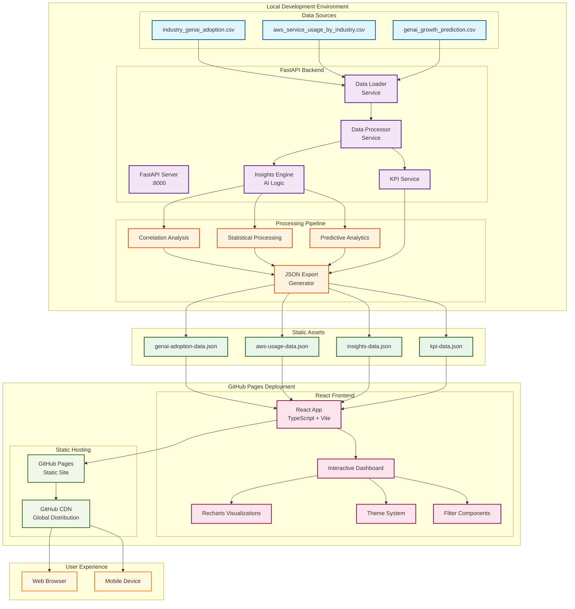

# GenAI Adoption Pulse - Architecture Diagram

## System Architecture Overview

## Architecture Components

### 1. Data Sources Layer
- **CSV Files**: Raw industry data, AWS usage metrics, and growth predictions
- **Local Storage**: File-based data management for development and processing

### 2. FastAPI Backend (Local Processing)
- **Data Loader Service**: CSV parsing and validation
- **Data Processor Service**: Data transformation and aggregation
- **Insights Engine**: AI-powered correlation analysis and trend detection
- **KPI Service**: Key performance indicator calculations

### 3. Processing Pipeline
- **Correlation Analysis**: Statistical relationships between GenAI adoption and AWS usage
- **Statistical Processing**: Confidence scoring and effect size calculations
- **Predictive Analytics**: Growth forecasting and trend analysis
- **JSON Export**: Static data generation for frontend consumption

### 4. Static Assets
- **Pre-generated JSON**: Processed data exported as static files
- **Optimized Payloads**: Structured data ready for frontend consumption
- **Version Control**: JSON files committed to repository

### 5. React Frontend
- **Interactive Dashboard**: Real-time visualizations using Recharts
- **Responsive Design**: Mobile-first approach with Tailwind CSS
- **Theme System**: Light/dark mode support
- **Filter Components**: Industry and year-based data filtering

### 6. GitHub Pages Hosting
- **Static Site Deployment**: Automated deployment from repository
- **Global CDN**: GitHub's content delivery network
- **HTTPS Support**: Secure content delivery
- **Custom Domain**: Optional custom domain configuration

## Data Flow Process

1. **Data Ingestion**: CSV files loaded and validated by FastAPI backend
2. **Processing**: AI logic generates insights, correlations, and predictions
3. **Export**: Processed data exported as static JSON files
4. **Build**: React frontend built with embedded JSON data
5. **Deploy**: Static site deployed to GitHub Pages
6. **Serve**: Users access dashboard through GitHub's CDN

## Key Benefits

- **Zero Runtime Costs**: No server infrastructure required
- **High Performance**: Pre-processed data and CDN delivery
- **Scalability**: GitHub Pages handles traffic automatically
- **Reliability**: Static hosting with 99.9% uptime
- **Security**: No backend attack surface in production
- **Simplicity**: Single repository deployment workflow

## Technology Stack Summary

| Layer | Technology | Purpose |
|-------|------------|---------|
| Data Processing | FastAPI + Python | Local data processing and AI logic |
| Frontend | React + TypeScript | Interactive dashboard |
| Build Tool | Vite | Fast development and optimized builds |
| Styling | Tailwind CSS | Responsive design system |
| Charts | Recharts | Data visualization components |
| Hosting | GitHub Pages | Static site hosting and CDN |
| CI/CD | GitHub Actions | Automated build and deployment |

---

*This architecture enables a cost-effective, scalable GenAI analytics dashboard with enterprise-grade performance and reliability.*